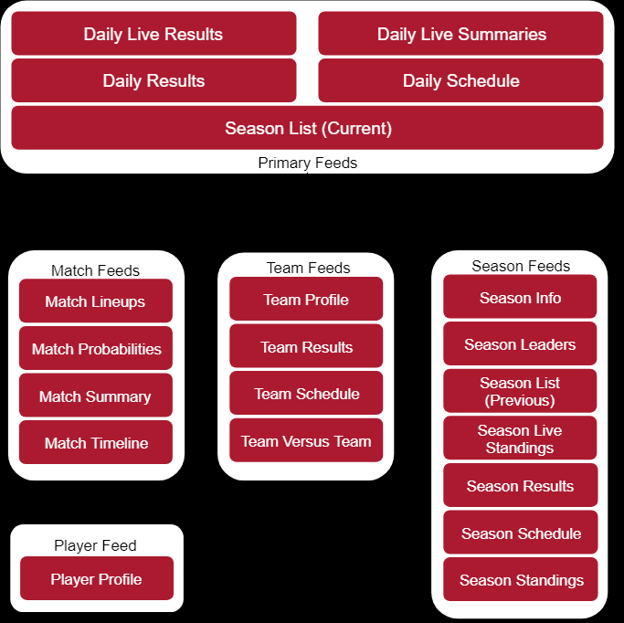

statmachine
===========

UCF Full Stack Developer Program –Final Project –Statmachine

Project requirements:

-   **Must use ReactJS Laravel React Native or Angular in some way (even if
    minimal)**

-   **Must use a Node and Express Web Server**

-   **Must be backed by a MySQL or MongoDB Database with a Sequelize or Mongoose
    ORM**

-   **Must have both GET and POST routes for retrieving and adding new data**

-   **Must be deployed using Heroku, AWS, etc. (with Data)**

-   **Must utilize at least two libraries, packages, or technologies that we
    haven’t discussed**

-   **Must allow for or involve the authentication of users in some way**

-   **Must have a polished frontend / UI**

-   **Must have folder structure that meets MVC Paradigm**

-   **Must meet good quality coding standards (indentation, scoping, naming)**

UCF Full Stack Developer Program –Final Project “Statmachine” wire frame

Create React Express App
========================

About This Boilerplate
----------------------

This setup allows for a Node/Express/React app which can be easily deployed to
Heroku.

The front-end React app will auto-reload as it's updated via webpack dev server,
and the backend Express app will auto-reload independently with nodemon.

Starting the app locally
------------------------

Start by installing front and backend dependencies. While in this directory, run
the following commands:

~~~~~~~~~~~~~~~~~~~~~~~~~~~~~~~~~~~~~~~~~~~~~~~~~~~~~~~~~~~~~~~~~~~~~~~~~~~~~~~~
yarn install
cd client
yarn install
cd ..
``

After both installations complete, run the following command in your terminal:
~~~~~~~~~~~~~~~~~~~~~~~~~~~~~~~~~~~~~~~~~~~~~~~~~~~~~~~~~~~~~~~~~~~~~~~~~~~~~~~~

yarn start

~~~~~~~~~~~~~~~~~~~~~~~~~~~~~~~~~~~~~~~~~~~~~~~~~~~~~~~~~~~~~~~~~~~~~~~~~~~~~~~~
That's it, your app should be running on <http://localhost:3000>. The Express server should intercept any AJAX requests from the client.

## Deployment (Heroku)

### Create a Git Repo

Once you're ready to deploy, start by making sure your project is a git repository. If so, proceed to the next section, otherwise run the following commands in your terminal:
~~~~~~~~~~~~~~~~~~~~~~~~~~~~~~~~~~~~~~~~~~~~~~~~~~~~~~~~~~~~~~~~~~~~~~~~~~~~~~~~

git init git add . git commit -m "Initial commit"

~~~~~~~~~~~~~~~~~~~~~~~~~~~~~~~~~~~~~~~~~~~~~~~~~~~~~~~~~~~~~~~~~~~~~~~~~~~~~~~~
### Heroku

Make sure that you have a Heroku app created for this project. If so, proceed to the next section, otherwise run the following command in your terminal:
~~~~~~~~~~~~~~~~~~~~~~~~~~~~~~~~~~~~~~~~~~~~~~~~~~~~~~~~~~~~~~~~~~~~~~~~~~~~~~~~

heroku create

~~~~~~~~~~~~~~~~~~~~~~~~~~~~~~~~~~~~~~~~~~~~~~~~~~~~~~~~~~~~~~~~~~~~~~~~~~~~~~~~
Optionally add an argument for your application's name after `create`, e.g.
~~~~~~~~~~~~~~~~~~~~~~~~~~~~~~~~~~~~~~~~~~~~~~~~~~~~~~~~~~~~~~~~~~~~~~~~~~~~~~~~

heroku myAwesomeApp

~~~~~~~~~~~~~~~~~~~~~~~~~~~~~~~~~~~~~~~~~~~~~~~~~~~~~~~~~~~~~~~~~~~~~~~~~~~~~~~~
### Deploying

#### Option 1

Use the deploy script inside of the outer `package.json`

After confirming that you have an up to date git repository and a Heroku app created, run the following command to deploy:
~~~~~~~~~~~~~~~~~~~~~~~~~~~~~~~~~~~~~~~~~~~~~~~~~~~~~~~~~~~~~~~~~~~~~~~~~~~~~~~~

yarn deploy

~~~~~~~~~~~~~~~~~~~~~~~~~~~~~~~~~~~~~~~~~~~~~~~~~~~~~~~~~~~~~~~~~~~~~~~~~~~~~~~~
If all previous steps were followed correctly, your application should be deployed to Heroku!

#### Option 2

Manually deploy 

After confirming that you have an up to date git repository and a Heroku app created, complete the following:

1. Build the React app for production by running the following command:
~~~~~~~~~~~~~~~~~~~~~~~~~~~~~~~~~~~~~~~~~~~~~~~~~~~~~~~~~~~~~~~~~~~~~~~~~~~~~~~~

yarn build \`\`\`

1.  Add and commit all changes to git

2.  Push to Heroku

If all previous steps were followed correctly, your application should be
deployed to Heroku!
